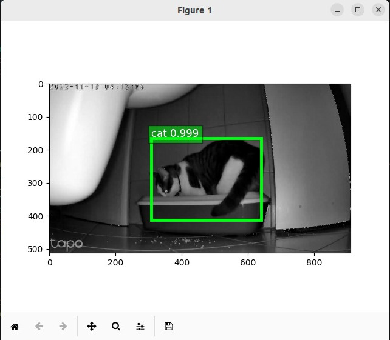
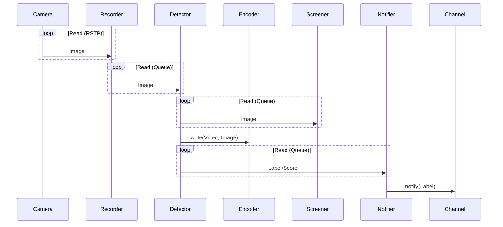

# About PyCatDetector

<a href="cookie.jpg"></a> 

Python Cat Detector is a tool to detect the presence of my cat ["Cookie"](pycatdetector/tests/images/cat1.jpg) near her litterbox and alerts me to clean it.

Basically, the application grabs video frames from an IP camera RTSP stream, uses a [neural network](pycatdetector/NeuralNet.py) to identify a cat object, and play a message in a speaker.

All hardware and software used by pycatdetector (i.e. Camera, Linux Server and Speaker) can reach each other via my local WiFi network.

## Architecture & Workflow

The software architecture is pretty simple as follows:



# Requirements

## General

This Python package has been tested and designed for:

* Hardware:
  * Depending on what you are doing 1-2 GB of RAM and a CPU with [AVX2 support](https://en.wikipedia.org/wiki/Advanced_Vector_Extensions).
  * An RTSP streaming device like the [TP-Link Tapo C210 Camera](https://www.tp-link.com/en/home-networking/cloud-camera/tapo-c210/) 
  * (Optional) A [discord webhook](https://support.discord.com/hc/en-us/articles/228383668) to be used as notification channel.
  * (Optional) A compatible IoT device like [Google Nest](https://store.google.com/product/google_nest_mini?hl=de) with HomeAssistant (see below).

* Software:
  * [Ubuntu Linux 22.04 LTS](https://releases.ubuntu.com/)
  * [Python 3.10.6](https://docs.python.org/3/) and several [python libraries](https://github.com/olafrv/pycatdetector/blob/master/requirements.txt).
  * PyCatDetector uses [Apache MXNet](https://attic.apache.org/projects/mxnet.html) but it is being [refactored](https://github.com/olafrv/pycatdetector/issues/4) to only rely on [PyTorch](https://pytorch.org/).
  * (Recommended) [Docker and/or Docker Compose](https://docs.docker.com/) for headless run (no graphical features).
  * (Optional) [HomeAssistant](https://www.home-assistant.io/) endpoint for Text-To-Speach (TTS) service.


## AVX Instruction Set

> **NOTICE:** If your Linux is a Virtual Machine running on a Windows host you \
> need to disable Windows Security > Core Isolation > Memory Protection.

### Linux (or WSL2)

Check if your CPU (or vCPU) is supporting the AVX instruction set:

```bash
cat /proc/cpuinfo | grep -i avx
```

### PyTorch

Run the following to check if AVX is enabled: [test_aaa_torch.py](./pycatdetector/tests/test_aaa_torch.py).

See more information on: \
https://pytorch.org/get-started/locally/#windows-verification

# Usage

## Configuration
```shell
sudo apt install make
git clone "https://github.com/olafrv/pycatdetector.git"
cd pycatdetector
mv config.example.yaml config.yaml # edit manually afterwards
```

## Run (Python)
```shell
make install         # install end user requirements
make check-config    # checks for YAML parsing errors
make run             # with python3 interpreter
```

## Run (Docker)

```shell
# If you don't have it (latest docker official version)
# https://github.com/docker/docker-install
curl -fsSL https://get.docker.com -o get-docker.sh; sh get-docker.sh
make docker.build    # build docker image with python requirements
make docker.run      # A) without compose, and removed after stopped
make docker.start    # B.1) with compose running in background as service
make docker.stop     # B.2) stop the composed container service
make docker.sh       # B.3) open bash in the container service
make docker.clean    # delete local docker images to save space
```

## Uninstall

```shell
make uninstall       # remove python requirements and disposable folders
```

## Advanced/Developement

```shell
# Metadata and Requirements
make metadata             # show release METADATA file content
make install.dev          # install development requirements
make package.outdated     # check outdated python packages
# Binary build with Nuitka3
make build                # build binary with nuitka3
make clean                # delete local disposable files
make run.bin              # run ./dist/main.bin dynamically linked binary
# Profiling and Testing
make profile              # run python3 profiling over main.py
make profile.view         # check profiling results with snake
make test                 # run ./pycatdetector/tests/*
make test.coverage        # check call coverage during runtime
make test.coverage.report # check test coverage after runtime
# GitHub Release
# See Makefile for required GITHUB_* required variables
# Adjust METADATA file before running the following commands
make github.push          # push docker image to github registry
make github.release       # create a new github relase
```

# References

## OpenCV - a.k.a. cv2
* https://pypi.org/project/opencv-python/
* https://docs.opencv.org/4.6.0/d6/d00/tutorial_py_root.html
* https://docs.opencv.org/3.0-beta/doc/py_tutorials/py_gui/py_video_display/py_video_display.html
* https://answers.opencv.org/question/24714/skipping-frames-in-videocapture/
* https://docs.opencv.org/4.x/dd/d9e/classcv_1_1VideoWriter.html

## PyTorch & Torchvision
* https://pytorch.org/vision/stable/index.html
* https://pytorch.org/vision/stable/models.html#classification
* https://pytorch.org/vision/main/models/faster_rcnn.html
* https://pytorch.org/vision/stable/auto_examples/others/plot_visualization_utils.html

## GluonCV (Legacy)
* https://cv.gluon.ai/
* https://cv.gluon.ai/install.html
* https://cv.gluon.ai/tutorials/index.html
* https://cv.gluon.ai/build/examples_detection/demo_ssd.html
* https://github.com/dmlc/gluon-cv
* https://mxnet.apache.org/versions/0.12.1/tutorials/gluon/ndarray.html
* https://cv.gluon.ai/_modules/gluoncv/data/transforms/presets/ssd.html
* https://cv.gluon.ai/api/model_zoo.html

## Apache MXNet (Legacy)
* https://mxnet.apache.org/versions/0.11.0/
* https://mxnet.apache.org/versions/1.6/api/python/docs/tutorials/packages/ndarray/gotchas_numpy_in_mxnet.html
* https://mxnet.apache.org/versions/1.9.1/api/python/docs/api/mxnet/image/index.html#mxnet.image.imdecode

## PIL
* https://pillow.readthedocs.io/en/stable/reference/Image.html#PIL.Image.frombytes

## Deep Learning
* https://d2l.ai/chapter_computer-vision/bounding-box.html

## PEP 8 – Style Guide for Python Code
* https://peps.python.org/pep-0008/

## PEP 0 – Index of Python Enhancement Proposals (PEPs)
* https://peps.python.org/pep-0000/