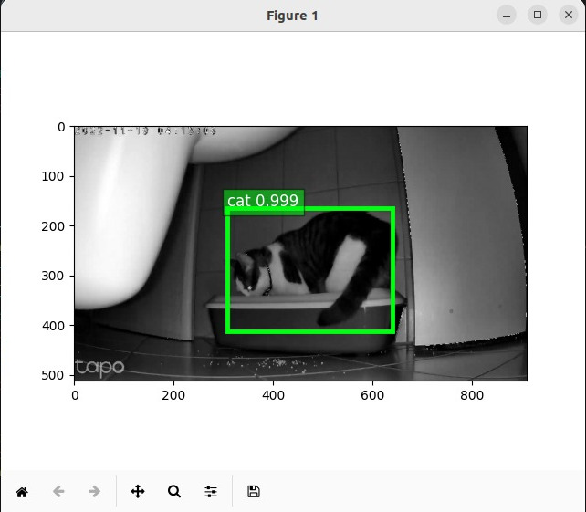

# About PyCatDetector

 

Python Cat Detector is a "2-days-solution" that detects the presence of my cat ["Cookie"](tests/cookie.jpeg) near her litterbox and alerts me to clean it.

Basically, the application grabs video frames from an IP camera RTSP stream, uses a neural network to identify a cat object, and play a message in a speaker.

All hardware and software used by pycatdetector (i.e. Camera, Linux Server and Speaker) can reach each other via my local WiFi network.

The software architecture is pretty simple (or not?) as follows:

* Camera -> RTSP -> Recorder.py (OpenCV)
* Recorder.py -> Queue (Image) -> Detector.py -> NeuralNet.py (GluonCV / Apache MXNet)
* Detector.py -> Queue (Test) -> Screener.py (Mathplotlib)
* Detector.py -> Queue (Detections) -> Notifier.py
* Notifier.py -> HAGoogleSay.py (HomeAssistant API)

# Requirements

This Python package has been tested and designed for:

* Hardware:
  * 1 GB of RAM and a CPU (depending of what you are doing) with [AVX2 support](https://en.wikipedia.org/wiki/Advanced_Vector_Extensions).
  * An RTSP streaming device like the [TP-Link Tapo C210 Camera](https://www.tp-link.com/en/home-networking/cloud-camera/tapo-c210/) 
  * A compatible IoT device like [Google Nest](https://store.google.com/product/google_nest_mini?hl=de) with HomeAssistant (see below).

* Software:
  * [Ubuntu Linux 22.04 LTS](https://releases.ubuntu.com/)
  * [Python 3.10.6](https://docs.python.org/3/) and several [python libraries](https://github.com/olafrv/pycatdetector/blob/master/requirements.txt).
  * (Optional) [Docker and/or Docker Compose](https://docs.docker.com/) for headless run (no graphical features).
  * (Optional) [HomeAssistant](https://www.home-assistant.io/) endpoint for Text-To-Speach (TTS) service.

*NOTE:* If your Linux is a Virtual Machine running on a Windows host you need to disable Windows Security > Core Isolation > Memory Protection.

# Usage

## Configuration
```shell
git clone "https://github.com/olafrv/pycatdetector.git"
cd pycatdetector
mv config.json.example config.json   # then edit config options
```
## Basic
```shell
make install
make run
```

## Docker

```shell
make docker.build
make docker.run
```
## Docker
```
make docker.build
docker compose up   # add '-d' to run in foreground
```

# References
## OpenCV
* https://docs.opencv.org/3.0-beta/doc/py_tutorials/py_gui/py_video_display/py_video_display.html
* https://answers.opencv.org/question/24714/skipping-frames-in-videocapture/

## GluonCV
* https://cv.gluon.ai/
* https://cv.gluon.ai/tutorials/index.html
* https://cv.gluon.ai/build/examples_detection/demo_ssd.html
* https://github.com/dmlc/gluon-cv
* https://mxnet.apache.org/versions/0.12.1/tutorials/gluon/ndarray.html
* https://cv.gluon.ai/_modules/gluoncv/data/transforms/presets/ssd.html
* https://cv.gluon.ai/api/model_zoo.html

## Apache MXNet
* https://mxnet.apache.org/versions/0.11.0/
## PIL
* https://pillow.readthedocs.io/en/stable/reference/Image.html#PIL.Image.frombytes

## PEP 8 – Style Guide for Python Code
* https://peps.python.org/pep-0008/
## PEP 0 – Index of Python Enhancement Proposals (PEPs)
* https://peps.python.org/pep-0000/